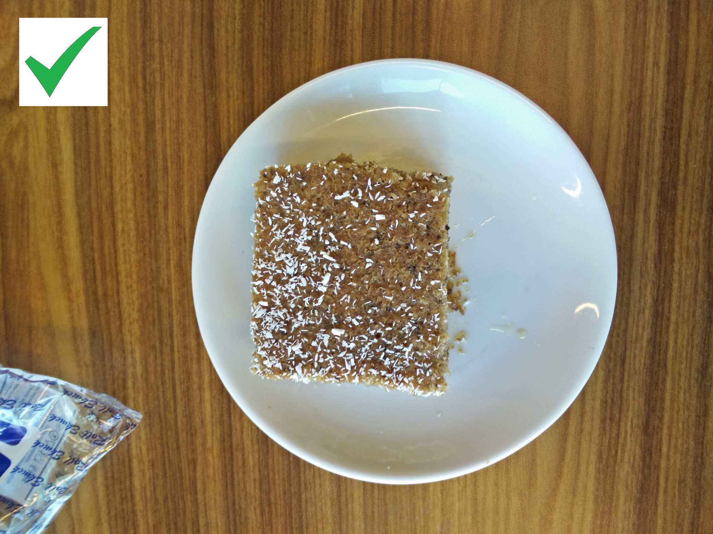
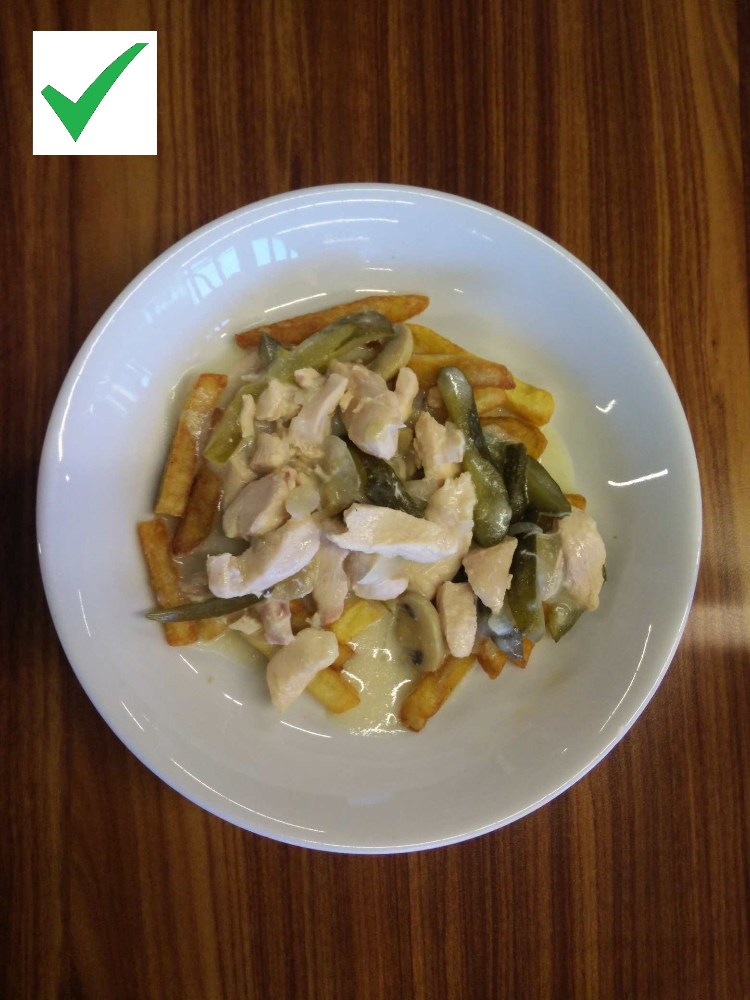
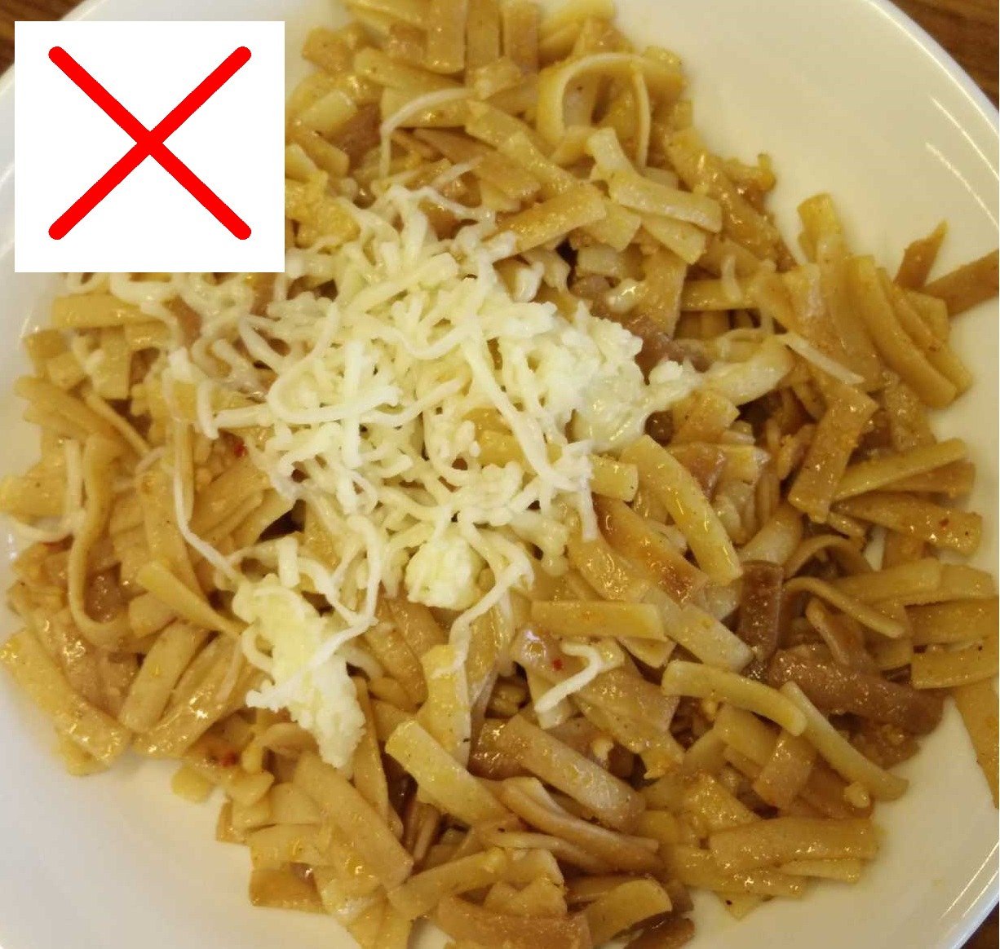
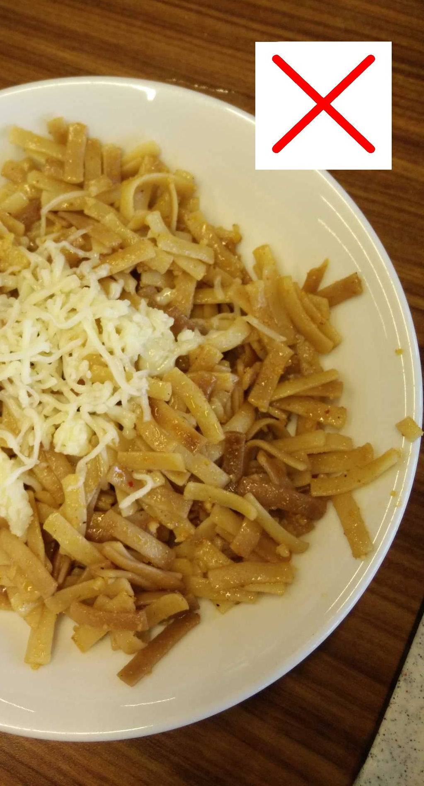
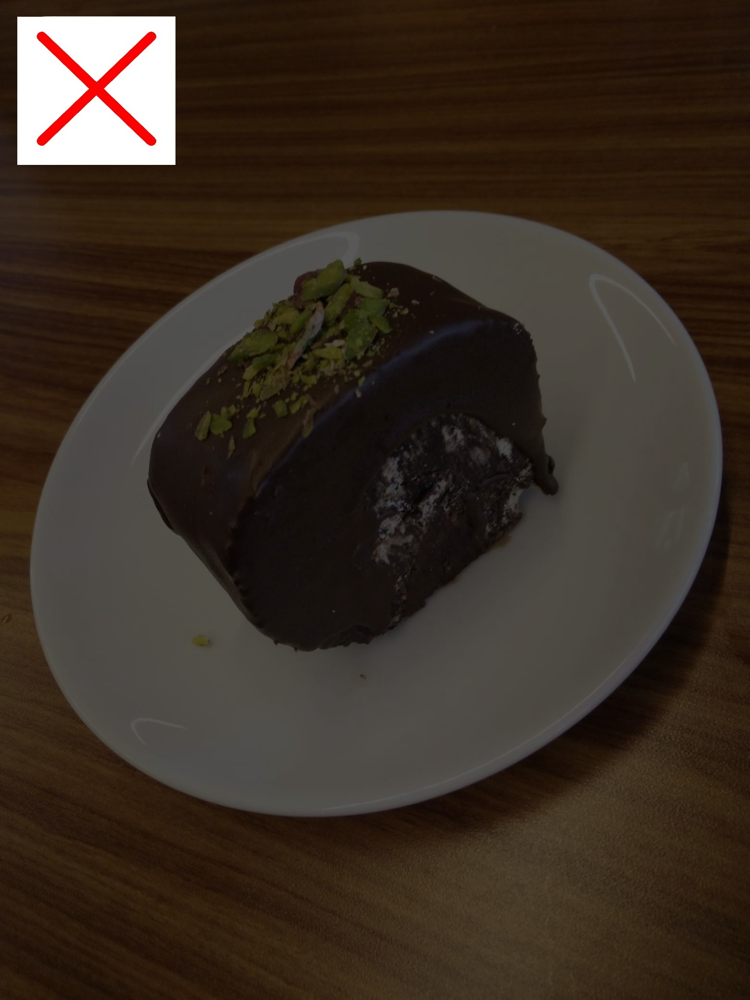
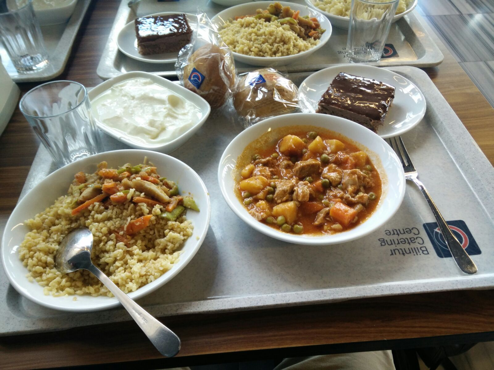

# Image Contribution Guidelines

If you wish to contribute images to help fill our collection with the missing ones, take a picture of the meal and send it to us. Some guidelines below

### 1. Take a picture from above the meal, not on the side. Some examples below

Example:

| Correct Submission                                                                      | Correct Submission                                                                      |
| --------------------------------------------------------------------------------------- | --------------------------------------------------------------------------------------- |
|  |  |

| Incorrect Submission                                                                                        | Incorrect Submission                                                                                        |
| ----------------------------------------------------------------------------------------------------------- | ----------------------------------------------------------------------------------------------------------- |
| Cropped image not allowed                                                                                   | Cropped image not allowed                                                                                   |
|  |  |

| Incorrect Submission                                                                                        | Incorrect Submission                                                                                     |
| ----------------------------------------------------------------------------------------------------------- | -------------------------------------------------------------------------------------------------------- |
| the picture's brightness is too low                                                                         | Wrong meal group - not the actual meal                                                                   |
|  |  |

### Several options given below on how to submit. Pick whatever is feasible to you.

### [Option 1] Create a PR and commit the new missing image to it

Please adhere to the PR Titles following the examples below. Make sure to include the Turkish characters also if you can. Omit the english name of the meal.

**[Missing-Image] Mozaik Pasta.jpg**

**[Missing-Image] Piliç stragonof.jpg**

**[Missing-Image] Ayranaşı çorba.jpg**

Rename the image file to the exact meal name, add it to the `/missing-images` folder and commit it.

 

### [Option 2] Attach the image to the issue [here](https://github.com/ndricimrr/bilmenu/issues/27)

Follow [this issue](https://github.com/ndricimrr/bilmenu/issues/27) instructions to add the image there, if creating a PR is not feasible for you.

 

### [Option 3] Send the image as an email to us

Send an email to <a href="mailto:bilmenudeveloper@gmail.com">bilmenudeveloper@gmail.com</a>.

**Example Email:**

    Subject: [Missing-Image] Mozaik Pasta.jpg

    Email content:

    Time taken: 12.02.2024 at 13:00

    <- Attached image  >
