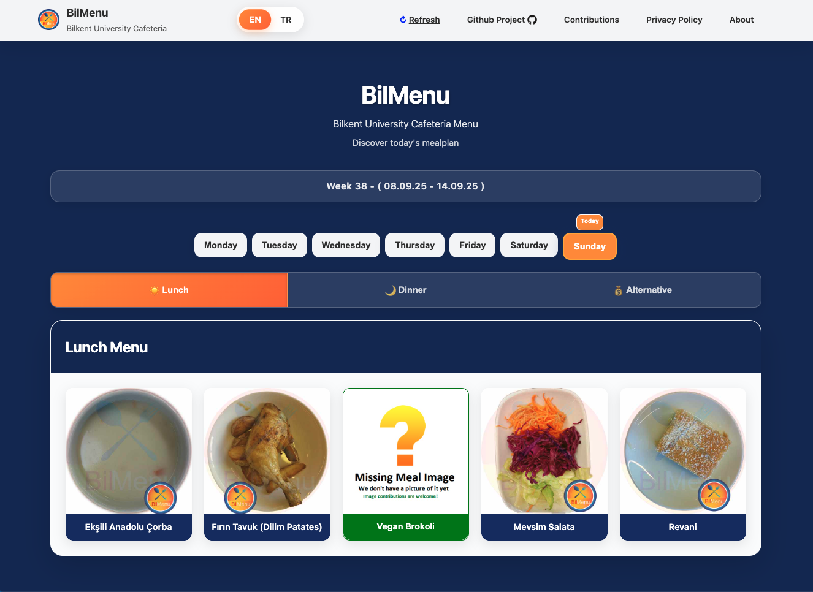
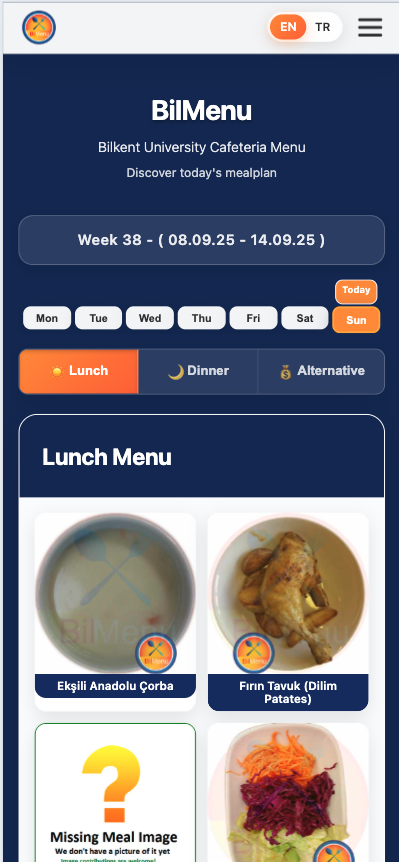

# BilMenu - Bilkent University Cafeteria Menu Project

<div align="center">
  
  <br>
  <em>Desktop Web Interface</em>
</div>

<div align="center">
  
  <br>
  <em>Mobile Interface</em>
</div>

**🌐 Live Demo:** [www.bilmenu.com](https://www.bilmenu.com)  
**📱 Mobile App:** 
- iOS: [Download on App Store](https://apps.apple.com/de/app/bilmenu/id6752549798)
- Android: [Download on Play Store](https://play.google.com/store/apps/details?id=com.bilmenu.app)
 

Welcome to the BilMenu project! This open-source project aims to provide a simple and interactive way for Bilkent University students to view cafeteria menus for different days of the week. The project focuses on displaying meal options with images, creating an easy-to-navigate interface for users.

A little history on how the app came to be [here](history.md)

## ✨ Features

- 📅 **Weekly Menu View**: Browse cafeteria menus for each day of the week
- 🤖 **AI-Powered Parsing**: Automated meal data extraction with high accuracy
- 🍽️ **Meal Categories**: Explore lunch, dinner, and alternative meal options
- 🖼️ **Visual Interface**: Dynamic grid layout with meal images and labels
- 📱 **Responsive Design**: Optimized for desktop, tablet, and mobile devices
- 🔍 **Modal View**: Enlarged display of selected meal items with details
- 🌍 **Bilingual Support**: Switch between English and Turkish languages
- ⚡ **Real-time Updates**: Current week indicator with date ranges
- 🎨 **Modern UI/UX**: Clean, professional interface with smooth animations
- 🔄 **Error Handling**: User-friendly error messages with refresh options

## Getting Started

## Information

- Site that is parsed: http://kafemud.bilkent.edu.tr/monu_eng.html
- After parsing the result is served on our side on this json file: `https://www.bilmenu.com/mealplans/meal_plan_week_[Insert Week Number]_[Insert Year].json`

### Prerequisites

- Web browser (Chrome, Firefox, Safari, etc.)

### Installation

1. Clone the repository:

   ```bash
   git clone https://github.com/ndricimrr/bilmenu.git
   cd bilmenu
   ```

2. Serve the web application:

   **Option 1: Python (Recommended)**

   ```bash
   # Python 3
   python -m http.server 8000

   # Python 2
   python -m SimpleHTTPServer 8000
   ```

   **Option 2: Node.js**

   ```bash
   npx serve webapp -p 8000
   ```

   **Option 3: PHP**

   ```bash
   php -S localhost:8000 -t webapp
   ```

3. Open your browser and navigate to `http://localhost:8000`

### Current Status

✅ **Web Application**: Fully functional with modern UI/UX  
✅ **Mobile Responsive**: Optimized for all device sizes  
✅ **Bilingual Support**: English and Turkish language switching  
✅ **AI-Powered Parsing**: Automated meal data extraction  
🌐 **Live at**: [www.bilmenu.com](https://www.bilmenu.com)

## Contributions

Contributions are welcomed and encouraged.

- Contribute Images to the image dataset - [Guideline](/CONTRIBUTING_IMAGES.md)
- Code Contribution -[Guideline](/CONTRIBUTING_GUIDELINES.md)
