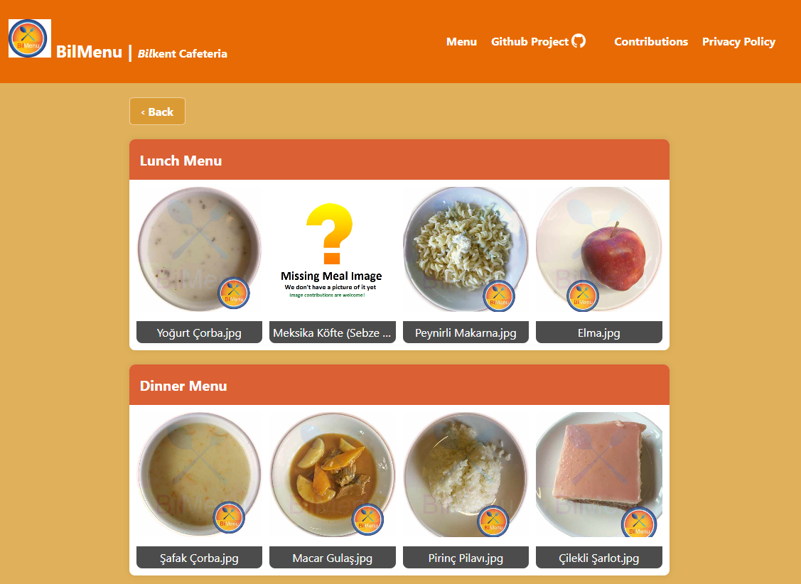

# BilMenu - Bilkent University Cafeteria Menu Project

Welcome to the BilMenu project! This open-source project aims to provide a simple and interactive way for Bilkent University students to view cafeteria menus for different days of the week. The project focuses on displaying meal options with images, creating an easy-to-navigate interface for users.

A little history on how the app came to be [here](history.md)

## Features

- View cafeteria menus for each day of the week.
- Explore lunch, dinner, and alternative meal options for each day.
- Dynamic grid layout for meal items, including images and labels.
- Responsive design for optimal viewing on both desktop and mobile devices.
- Modal view for an enlarged display of selected meal items.
- Contributions welcome for collecting more meal images, improving code quality, enhancing UX, and keeping the parsing algorithm up to date.

## Getting Started

## Information

- Site that is parsed: http://kafemud.bilkent.edu.tr/monu_eng.html
- After parsing the result is served on our side on this json file: `https://www.bilmenu.com/mealplans/meal_plan_week_[Insert Week Number]_[Insert Year].json`

### Prerequisites

- Web browser (Chrome, Firefox, Safari, etc.)

### Installation

1. Clone the repository:

   ```bash
   git clone https://github.com/ndricimrr/bilmenu.git
   ```

### Current Status UI Web (In Progress) Go to -> www.bilmenu.com



## Contributions

Contributions are welcomed and encouraged.

- Contribute Images to the image dataset - [Guideline](/CONTRIBUTING_IMAGES.md)
- Code Contribution -[Guideline](/CONTRIBUTING_GUIDELINES.md)
